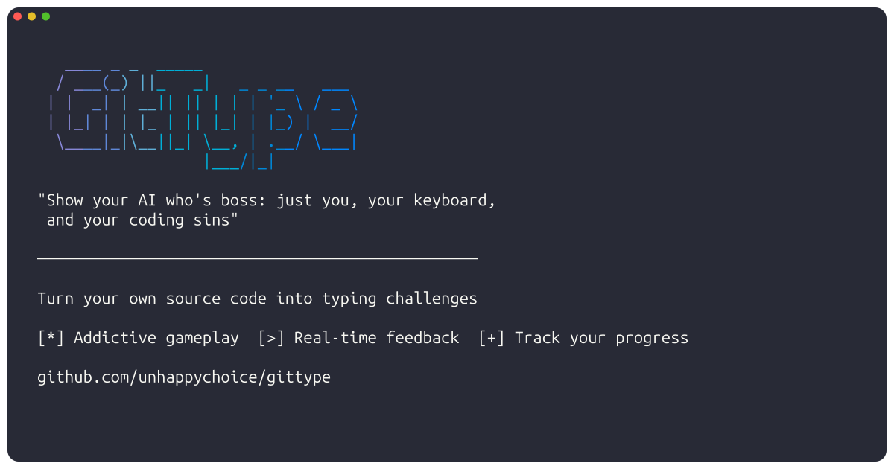
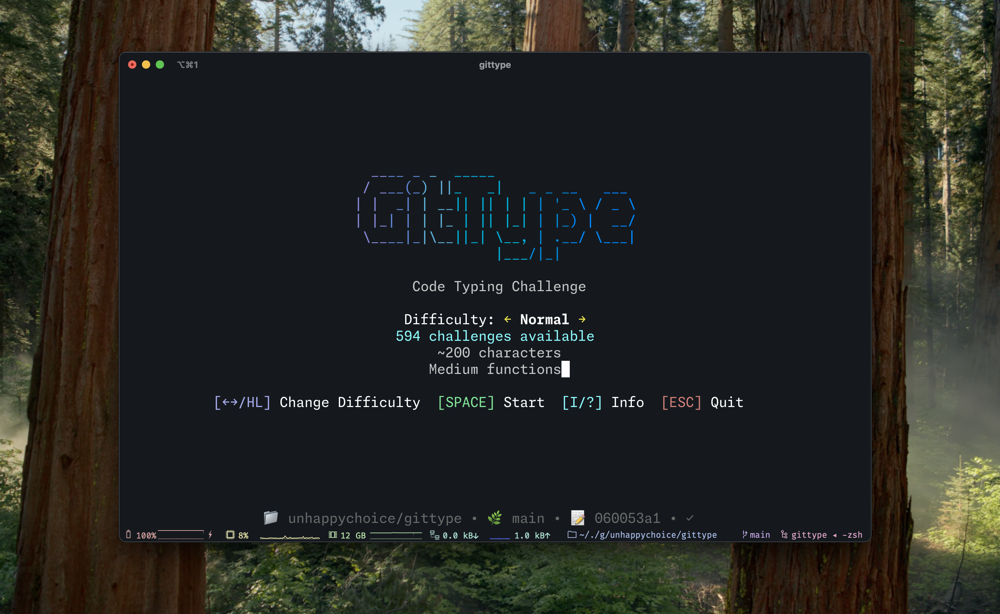
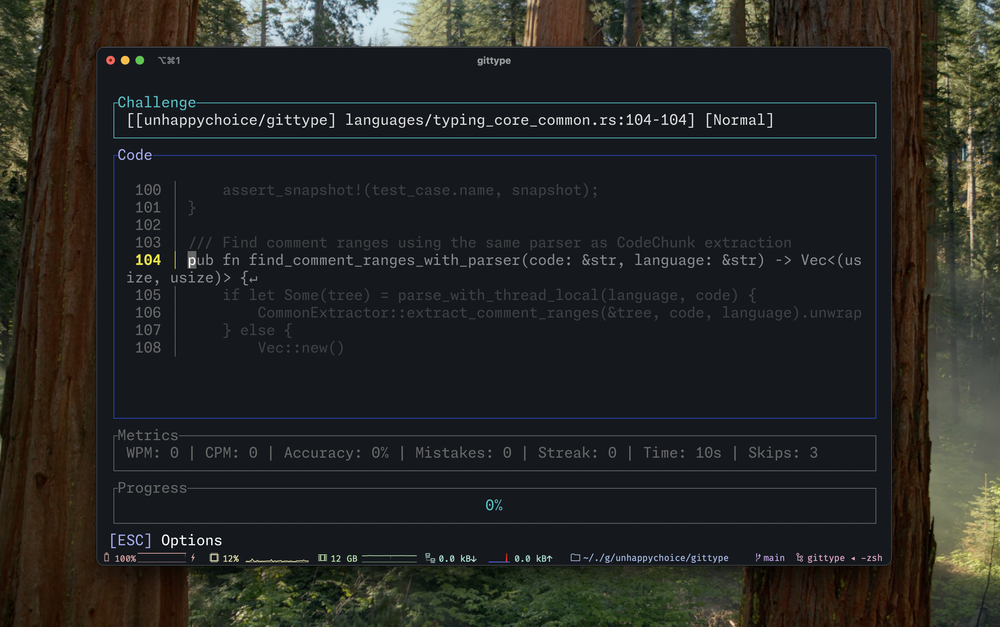
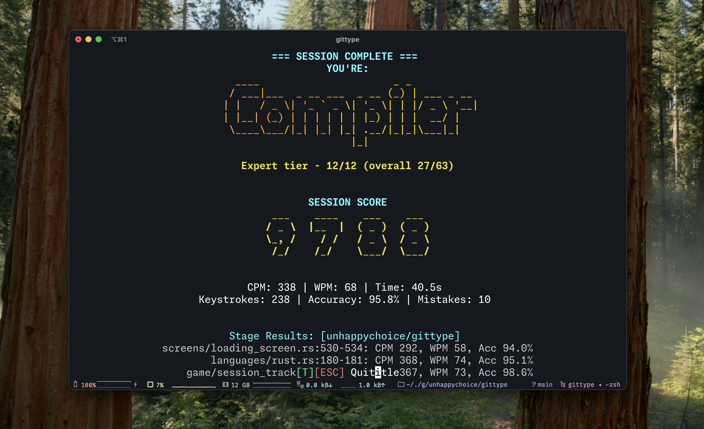

# GitType ⌨️💻

> *"Show your AI who's boss: just you, your keyboard, and your coding sins"*

**GitType** turns your own source code into typing challenges. Because why practice with boring lorem ipsum when you can type your beautiful `fn main()` implementations?

## Demo 🎬


## Features ✨

- 🦀🐍⚡🐹💎🍎🎯☕🐘#️⃣🔧➕🎭🎯 **Multi-language**: Rust, TypeScript, JavaScript, Python, Go, Ruby, Swift, Kotlin, Java, PHP, C#, C, C++, Haskell, Dart, Scala (more languages incoming!)  
- 📊 **Real-time metrics**: Live WPM, accuracy, and consistency tracking as you type
- 🏆 **Ranking system**: Unlock developer titles from "Hello World Newbie" to "Quantum Computer" with ASCII art
- 🎮 **Multiple game modes**: Normal, Time Attack, and custom difficulty levels (Easy to Zen)
- ⏸️ **Pause/resume**: Take breaks without ruining your stats
- 🎯 **Your own code**: Type functions from your actual projects, not boring examples

## Installation 📦

### Quick Install (Recommended)
#### One-liner installation (Linux/macOS/Windows)
```bash
curl -sSL https://raw.githubusercontent.com/unhappychoice/gittype/main/install.sh | bash
```

#### Or with specific version
```bash
curl -sSL https://raw.githubusercontent.com/unhappychoice/gittype/main/install.sh | bash -s -- --version v0.5.0
```

### Homebrew (macOS/Linux)
```bash
brew install unhappychoice/tap/gittype
```


### Cargo (Universal)
```bash
cargo install gittype
```

### Binary Downloads
Get pre-compiled binaries for your platform from our [releases page](https://github.com/unhappychoice/gittype/releases/latest).

Available platforms:
- `x86_64-apple-darwin` (Intel Mac)
- `aarch64-apple-darwin` (Apple Silicon Mac)
- `x86_64-unknown-linux-gnu` (Linux x64)
- `aarch64-unknown-linux-gnu` (Linux ARM64)
- `x86_64-pc-windows-msvc` (Windows)

## Quick Start 🚀

```bash
# cd into your messy codebase
cd ~/that-project-you-never-finished

# Start typing your own spaghetti code (uses current directory by default)
gittype

# Or specify a specific repository path
gittype /path/to/another/repo

# Clone and play with any GitHub repository
gittype --repo clap-rs/clap
gittype --repo https://github.com/ratatui-org/ratatui
gittype --repo git@github.com:dtolnay/anyhow.git
```

## Screenshots 📸







## Why GitType? 🤔

- **Look busy at work** → "I'm studying the codebase" (technically true!)
- **Beat the AI overlords** → Type faster than ChatGPT can generate
- **Stop typing boring stuff** → Your own bugs are way more interesting than lorem ipsum
- **Discover forgotten treasures** → That elegant function you wrote at 3am last year
- **Procrastinate like a pro** → It's code review, but gamified!
- **Embrace your legacy code** → Finally face those variable names you're not proud of
- **Debug your typing skills** → Because `pubic static void main` isn't a typo anymore
- **Therapeutic code reliving** → Type through your programming journey, tears included
- **Climb the dev ladder** → From "Code Monkey" to "Quantum Computer" - each rank comes with fancy ASCII art

*"Basically, you need an excuse to avoid real work, and this one's pretty good."*

## Documentation 📚

Perfect for when the game gets too addictive:

- **[Installation](docs/installation.md)** - `cargo install` and chill
- **[Usage](docs/usage.md)** - All the CLI flags your heart desires  
- **[Languages](docs/supported-languages.md)** - What we extract and how
- **[Contributing](docs/CONTRIBUTING.md)** - Join the keyboard warriors
- **[Architecture](docs/ARCHITECTURE.md)** - For the curious minds

## License 📄

[MIT](LICENSE) - Because sharing is caring (and legal requirements)

---

*Built with ❤️ and way too much caffeine by developers who got tired of typing "hello world"*
